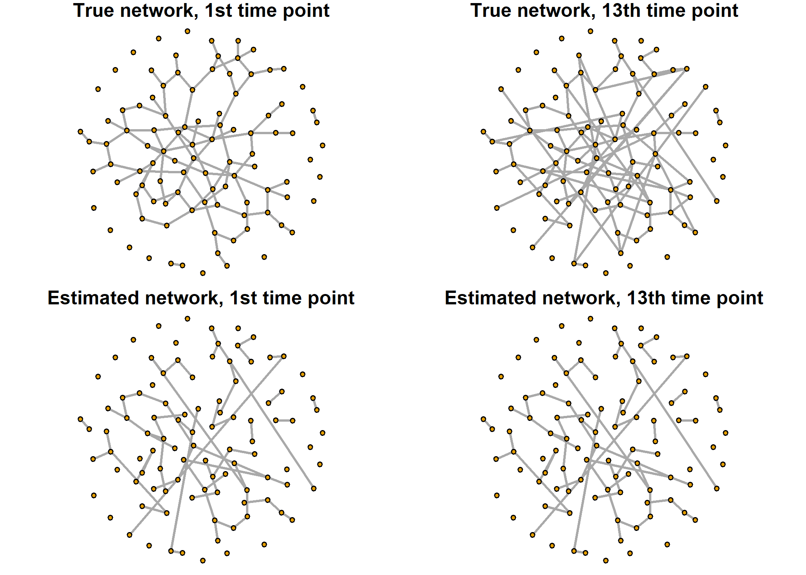

# `rTVGL`: Time-Varying Graphical LASSO for R

This R package implements the time-varying graphical LASSO method
introduced by Hallac et al. (2017). The ADMM algorithm is adapted from
the Python package `regain` (Tomasi et al., 2018).

The package is a work in progress, and all documentation will be added
in the future.

## Installation

The `rTVGL` package can be installed using the following code:

``` r
if(!require("devtools", quietly = TRUE)) {
  install.packages("devtools")
}
devtools::install_github("THautamaki/rTVGL")
```

## Example of usage

This is a minimum working example. Load the package and define variables
used in the data simulation.

``` r
library(rTVGL)
n <- 50         # Number of observations per time point (sample size)
p <- 100        # Number of variables
n_tp <- 20      # Number of time points
step_size <- 5  # Number of time points between changes in the network structure
cps <- seq(step_size, n_tp - step_size, step_size)  # Vector of actual change points
number_add_del <- 10  # Number of edges been deleted and added in the change point
```

Generate simulated data using the `generate_timeseries_network_data`
function.

``` r
sim <- generate_timeseries_network_data(n = n, p = p, n_timepoints = n_tp, change_points = cps,
                                        n_add_del = number_add_del, seed_net = 20260511,
                                        seed_data = 20260511)
```

Run the TVGLASSO method using the `tvgl` function and $l_1$ penalty over
the time.

``` r
results <- tvgl(sim$datasets[[1]], lambda = 0.25, beta = 0.25, penalty_type = "l1")
```

    ## Convergence reached at iteration 45. Elapsed time 1.978 s.

Calculate and print the confusion matrix for the first time point.

``` r
(cm <- conf_matrix(sim$Thetas[,,1], results$Theta_ests[,,1]))
```

    ##        Estim. P Estim. N
    ## True P       72       28
    ## True N       10     4840

Calculate and print some performance scores.

``` r
round(calculate_scores(cm)[, c("MCC", "F1", "TPR", "FDR")], 4)
```

    ##      MCC     F1  TPR   FDR
    ## 1 0.7914 0.7912 0.72 0.122

Same for the 13th time point.

``` r
(cm <- conf_matrix(sim$Thetas[,,13], results$Theta_ests[,,13]))
```

    ##        Estim. P Estim. N
    ## True P       63       47
    ## True N        0     4840

``` r
round(calculate_scores(cm)[, c("MCC", "F1", "TPR", "FDR")], 4)
```

    ##      MCC     F1    TPR FDR
    ## 1 0.7531 0.7283 0.5727   0

Plot the true simulated network and estimated network using the R
package `igraph`.

``` r
if(!require("igraph", quietly = TRUE)) {
  install.packages("igraph")
}
library(igraph)
```

Generate graph objects using `graph_from_adjacency_matrix` function from
`igraph` package.

``` r
true_network_1 <- graph_from_adjacency_matrix(sim$Thetas[,,1], mode = "undirected", diag = F)
true_network_13 <- graph_from_adjacency_matrix(sim$Thetas[,,13], mode = "undirected", diag = F)
est_network_1 <- graph_from_adjacency_matrix(results$Theta_ests[,,13], mode = "undirected", diag = F)
est_network_13 <- graph_from_adjacency_matrix(results$Theta_ests[,,13], mode = "undirected", diag = F)
```

Create coordinates for the nodes of the network. Use the same node
placement for both plots.

``` r
set.seed(10)
coords <- layout_with_fr(true_network_1)
```

Finally, plot both the true and estimated networks.

``` r
par(mfrow = c(2,2), mar = c(0.1, 0.1, 1, 0.1))
plot(true_network_1, layout = coords, edge.width = 2, vertex.size = 4, vertex.label = NA,
     main = "True network, 1st time point")
plot(true_network_13, layout = coords, edge.width = 2, vertex.size = 4, vertex.label = NA,
     main = "True network, 13th time point")
plot(est_network_13, layout = coords, edge.width = 2, vertex.size = 4, vertex.label = NA,
     main = "Estimated network, 1st time point")
plot(est_network_13, layout = coords, edge.width = 2, vertex.size = 4, vertex.label = NA,
     main = "Estimated network, 13th time point")
```



## References

- Hallac, D., Park, Y., Boyd, S., & Leskovec, J. (2017). Network
  inference via the time-varying graphical lasso. In *Proceedings of the
  23rd ACM SIGKDD international conference on knowledge discovery and
  data mining* (pp. 205-213).
- Tomasi, F., Tozzo, V., Salzo, S., & Verri, A. (2018). Latent variable
  time-varying network inference. In *Proceedings of the 24th ACM SIGKDD
  International Conference on Knowledge Discovery & Data Mining*
  (pp. 2338-2346).
